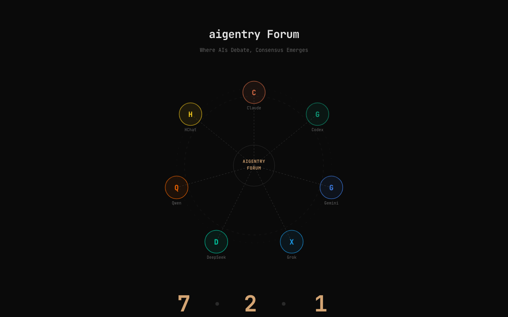

# @dmsdc-ai/aigentry-deliberation

**Structured multi-AI discussions via MCP.**

The only MCP server that lets multiple AI agents debate a question before committing to a decision. Run structured discussions across CLI agents (Claude Code, Codex, Gemini) and browser LLMs (ChatGPT, Claude Web, Gemini Web) with full audit trails, vote tracking, and synthesis.

## What it does

- **Structured deliberation sessions** — pose a topic, route turns to each speaker, collect [AGREE]/[DISAGREE]/[CONDITIONAL] votes, synthesize consensus
- **Smart speaker ordering** — cyclic, random, or weighted-random strategies to balance participation
- **Persona roles** — assign critic, implementer, mediator, researcher, or free roles with built-in prompt templates
- **Browser LLM integration** — CDP-based auto-turn for ChatGPT, Claude Web, Gemini Web and more; clipboard fallback for unsupported providers
- **Typed synthesis output** — structured `ExecutionContractV2` envelopes with decisions, actionable tasks, and optional experiment verdicts for downstream automation

## Installation

One-command install — registers the MCP server with Claude Code and Gemini CLI automatically:

```bash
npx --yes --package @dmsdc-ai/aigentry-deliberation deliberation-install
```

This installs the server to `~/.local/lib/mcp-deliberation/` (Windows: `%LOCALAPPDATA%/mcp-deliberation/`), registers it in `~/.claude/.mcp.json` and `~/.gemini/settings.json`, and installs the `deliberation-gate` skill to `~/.claude/skills/`.

Restart Claude Code / Gemini CLI after install. That's it.

**Global install (alternative):**

```bash
npm install -g @dmsdc-ai/aigentry-deliberation && deliberation-install
```

**Uninstall:**

```bash
npx --yes --package @dmsdc-ai/aigentry-deliberation deliberation-install --uninstall
```

Removes MCP registrations, installed files, and skill files automatically.

**Diagnostics:**

```bash
npx --yes --package @dmsdc-ai/aigentry-deliberation deliberation-doctor
```

Auto-diagnoses MCP configuration for Claude Code, Codex CLI, and Gemini CLI.

## Forum Demo

When a deliberation completes, the synthesized result can be visualized as a Forum view.

> Deliberation is the process. Forum is the output. When deliberation ends, the Forum is generated.



```bash
open demo/forum/index.html
```

## MCP Tools

| Tool | Description |
|------|-------------|
| `deliberation_start` | Start a new deliberation session |
| `deliberation_respond` | Submit a speaker's response |
| `deliberation_synthesize` | Generate synthesis report |
| `deliberation_status` | Check session status |
| `deliberation_context` | Load project context |
| `deliberation_inject_context` | Inject structured context or experiment history into an active session |
| `deliberation_history` | View discussion history |
| `deliberation_list_active` | List active sessions |
| `deliberation_list` | List archived sessions |
| `deliberation_reset` | Reset session(s) |
| `deliberation_speaker_candidates` | List available speakers |
| `deliberation_confirm_speakers` | Confirm the exact user-selected speaker set |
| `deliberation_browser_llm_tabs` | List open browser LLM tabs |
| `deliberation_browser_auto_turn` | Auto-send turn to a browser LLM via CDP |
| `deliberation_route_turn` | Route turn to appropriate transport |
| `deliberation_run_until_blocked` | Auto-run mixed transports until completion or a manual block |
| `deliberation_request_review` | Request code review from deliberation participants |
| `deliberation_cli_auto_turn` | Auto-send turn to a CLI speaker |
| `deliberation_ingest_remote_reply` | Ingest a reply from a remote participant with explicit source metadata |
| `deliberation_cli_config` | Configure CLI settings |

## Start Flow

Speaker selection is enforced before a session can start. Raw candidate tokens cannot initiate a deliberation.

```text
1. deliberation_speaker_candidates(...)
2. User picks speakers in the TUI
3. deliberation_confirm_speakers(selection_token: "<candidate-token>", speakers: [...])
4. deliberation_start(selection_token: "<confirmed-token>", speakers: [...])
```

## Speaker Ordering Strategies

| Strategy | Description |
|----------|-------------|
| `cyclic` | Sequential round-robin (default) |
| `random` | Random selection each turn |
| `weighted-random` | Less-spoken speakers prioritized |

## Persona Roles

| Role | Focus |
|------|-------|
| `critic` | Risk analysis, weaknesses, counterarguments |
| `implementer` | Technical feasibility, code design |
| `mediator` | Consensus building, synthesis |
| `researcher` | Data, benchmarks, references |
| `free` | No role constraint (default) |

## Supported CLI Speakers

| CLI | Command | Status |
|-----|---------|--------|
| Claude Code | `claude` | Tested |
| Codex CLI | `codex` | Tested |
| Gemini CLI | `gemini` | Tested |
| Aider | `aider` | Supported |
| Cursor Agent | `cursor` | Supported |
| OpenCode | `opencode` | Supported |
| Continue | `continue` | Supported |

## Supported Browser LLMs

| Provider | Transport | Status |
|----------|-----------|--------|
| ChatGPT | CDP / Clipboard | Tested |
| Claude Web | CDP / Clipboard | Tested |
| Gemini Web | CDP / Clipboard | Tested |
| DeepSeek | CDP / Clipboard | Tested |
| Qwen | CDP / Clipboard | Tested |
| Poe | CDP / Clipboard | Tested |
| Copilot | CDP / Clipboard | Supported |
| Perplexity | CDP / Clipboard | Supported |
| Mistral | CDP / Clipboard | Supported |
| Grok | CDP / Clipboard | Supported |
| HuggingChat | CDP / Clipboard | Supported |

## Examples

See [`examples/`](examples/) for working session scripts and synthesis output samples.

## Experiment Retrospectives

For autoresearch-style keep/discard reviews, inject a compact experiment bundle after the session starts instead of bloating `topic`.

Guidelines:
- Keep injected JSON around 1.5–2KB
- Include only the last 3–5 relevant experiments
- Keep `key_changes` to at most 3 scalar before/after pairs
- Reference bulky artifacts (`results.tsv`, full `program.md`, JSONL logs) by path only

```text
deliberation_start(...)
deliberation_inject_context(
  session_id: "experiment-review-123",
  speaker: "dustcraw",
  context: "{\"past_experiments\":[{\"experiment_id\":\"dg-20260310-001\",\"signal_kind\":\"INTEREST_DRIFT\",\"patch_summary\":\"Raised relevanceThreshold from 0.30 to 0.35\",\"patch_kind\":\"config\",\"key_changes\":{\"relevanceThreshold\":{\"before\":0.3,\"after\":0.35}},\"score\":0.08,\"score_label\":\"promotion_rate_delta\",\"metric_name\":\"promotion_rate_delta\",\"metric_delta\":0.08,\"verdict\":\"positive\",\"followup_action\":\"kept\",\"reasoning\":\"Threshold raise reduced noise; promotion quality improved 8%\"}],\"experiment_count\":1,\"success_rate\":1.0}"
)
```

Synthesis output with an explicit experiment verdict:

```json
{
  "summary": "Lower the blast radius and re-run with stricter constraints.",
  "decisions": [
    "Keep the experiment loop bounded to one editable file",
    "Retry after restoring the failing test baseline"
  ],
  "actionable_tasks": [
    { "id": 1, "task": "Tighten editable globs", "priority": "high" }
  ],
  "experiment_outcome": {
    "verdict": "modify",
    "suggested_action": "iterate",
    "confidence": 0.78,
    "measurement_window_hours": 24
  }
}
```

## deliberation-gate (Superpowers Integration)

Installs a skill that inserts multi-AI verification gates at key [superpowers](https://github.com/obra/superpowers) workflow decision points.

**Scenarios:**
- **brainstorming** — multi-AI design validation before writing plans
- **code-review** — multi-AI review via `deliberation_request_review`
- **debugging** — multi-AI hypothesis verification when stuck

**Trigger:** Semi-automatic — skill recommends deliberation, user approves.

**Fallback:** Without MCP installed, falls back to self-criticism-based verification. With MCP installed, runs full multi-AI discussion.

**Auto-installed** by `deliberation-install`. Manual install:

```bash
cp skills/deliberation-gate/SKILL.md ~/.claude/skills/deliberation-gate/SKILL.md
```

**RFC:** [Prerequisites header for tool-dependent skills](https://github.com/obra/superpowers/issues/589)

## Telepty Transport (Advanced)

For teams using [telepty](https://github.com/dmsdc-ai/aigentry-telepty) to manage AI sessions, deliberation supports routing turns through the telepty bus — enabling cross-machine and cross-session deliberation flows.

- `deliberation_route_turn` publishes typed `turn_request` envelopes on `ws://localhost:3848/api/bus`
- `deliberation_run_until_blocked` continues across `cli_respond`, `browser_auto`, and `telepty_bus` speakers until a manual block
- Transport delivery tracked with a 5-second `inject_written` ack window
- Semantic completion tracked with a 60-second self-submit window
- `deliberation_synthesize` validates and emits typed `deliberation_completed` envelopes for downstream automation

### Cross-Machine Event Catalog

- **Guaranteed (daemon-emitted):** `inject_written`, `session_health`, `session_register`, `session.replaced`, `session.idle`, `thread.opened`, `thread.closed`, `handoff.*`, `message_routed`
- **Best-effort (bus relay only):** `turn_request`, `turn_completed`, `deliberation_completed`
- `kind` is the canonical event discriminator
- `target` identifies the telepty session target
- `payload.prompt` is the canonical prompt field for `turn_request`
- `source_host` is optional transport metadata for cross-machine tracing

## Remote Reply Ingress

For distributed setups where a remote participant cannot call local MCP tools directly, use the deliberation-owned semantic ingress instead of proxying raw bus events:

```text
deliberation_ingest_remote_reply(
  session_id: "...",
  speaker: "...",
  turn_id: "...",
  content: "...",
  source_machine_id: "peer-01",
  source_session_id: "remote-gemini-001",
  transport_scope: "remote_mcp",
  artifact_refs: ["results.jsonl"]
)
```

This preserves explicit provenance rather than inferring semantics from raw bus events.

## What's New

### v0.0.39
- Entitlement layer — Free/Pro/Team tier gating for deliberation features
- Gemini CLI model flags and Codex GPT-5.4 routing improvements

### v0.0.36
- Clarified mandatory TUI speaker-selection flow and confirmed-token handoff before `deliberation_start`
- Documented active telepty session discovery with lightweight `session_id` + `host/pid` locators
- Cross-project delivery: active session lookup now resolves across project state directories

### v0.0.35
- **Manual selection enforcement**: `deliberation_confirm_speakers` binds a fresh candidate snapshot to the exact user-picked speaker set before `deliberation_start`
- **Telepty session candidates**: active telepty sessions appear in speaker discovery with lightweight host/pid locators
- **Telepty bus routing**: telepty speakers route via typed `turn_request` envelopes with 5s transport and 60s semantic timeout tracking
- **Structured synthesis envelopes**: `deliberation_synthesize` validates typed payloads before telepty bus publication
- **Codex CLI hardening**: reduced prompt budgets, lower-friction exec profile, clearer timeout diagnostics

## Ecosystem

`@dmsdc-ai/aigentry-deliberation` is one module of the aigentry ecosystem — each is independently published and independently useful.

| Module | Package | Version | Role | Maturity |
| --- | --- | --- | --- | --- |
| **telepty** | `@dmsdc-ai/aigentry-telepty` | 0.7.0 | Cross-terminal / cross-machine prompt transport (PTY daemon) | Shipping |
| **brain** | `@dmsdc-ai/aigentry-brain` | 0.3.0 | Persistent cross-session memory (MCP server) | Early |
| **deliberation** | `@dmsdc-ai/aigentry-deliberation` | 0.0.47 | Multi-AI structured debate + synthesis (MCP server) | Early |
| **devkit** | `@dmsdc-ai/aigentry-devkit` | 0.1.14 | Installer/scaffold for the AI dev environment | Early |
| **aterm** | `@dmsdc-ai/aterm` | 0.2.14 | Terminal launcher with native session IPC | Early |
| **orchestrator** | *(unpublished)* | — | Control tower that drives sessions via telepty | Internal |

> Licenses: all MIT except `@dmsdc-ai/aterm` (UNLICENSED).

## License

MIT
